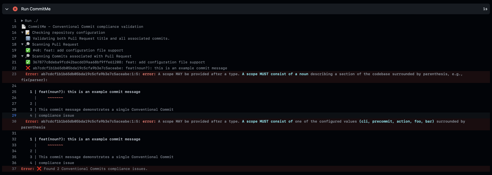

<!-- 
SPDX-FileCopyrightText: 2023 Kevin de Jong <monkaii@hotmail.com>

SPDX-License-Identifier: GPL-3.0-or-later
-->

# CommitMe

CommitMe provides multiple tools for validating commit messages against [Conventional Commits], incl.

* A CLI tool for managing your local (git) repository
* A GitHub Action to validate your Pull Request contents, incl:
  * Managing [labels](./docs/github-action.md#pull-request-labels) in your Pull Request
  * Two [validation strategies](./docs/github-action.md#validation-strategies) (Pull Request title only, Pull Request title _and_ associated commits) based on your repositories merge options


Both use the same [output format](#output-format) for expressing non-compliance issues.

## Specification

In addition to the [Conventional Commits] specification, extensions are added for [Conventional Commit messages](./docs/specifications.md#extended-conventional-commits-specification) and [Pull Requests](./docs/specifications.md#extended-pull-request-specification), providing additional rules such as:

- Limit the `type` and `scope` to a preconfigured list of items.
- Ensure that the Pull Request title is using a `type` correlating with its associated commits.

_Please refer to the [dedicated documentation](./docs/specifications.md) for more details._

## Output format

CommitMe is using an output format derived from LLVM's [expressive diagnostics formatting](https://clang.llvm.org/docs/ClangFormatStyleOptions.html#expressive-diagnostic-formatting);

```
2d9f21c2e2bb0f61ff88a99e5c0cb8d5771313c7:1:0: error: Commits MUST be prefixed with[...]
^                                        ^ ^         ^
|                                        | |         |
|                                        | |         `-- Conventional Commits requirement
|                                        | `-- Column bumber
|                                        `-- Line number
`-- Commit SHA                                   
```

> **NOTE**: Please refer to [dev-build-deploy/diagnose-it](https://github.com/dev-build-deploy/diagnose-it) for more details.

| Item | Description |
| --- | --- |
| `Commit SHA` | The commit hash of the commit containing non compliance issue |
| `Line number` | Which line in the commit message contains the issue (**NOTE**: line 1 indicates the subject) |
| `Column number` | Starting index of the non compliance issue |
| `Conventional Commits requirement` | Full description taken from the [Conventional Commits specification](https://www.conventionalcommits.org/en/v1.0.0/#specification), with highlights indicating which parts are non-compliant |

## Basic Usage

### Command Line Interface

The CLI tool can be used for local operations around your git repository, validating the commits in your current branch against the main branch (`main`).

> **NOTE** Option to specifiy the baseline branch will be added later

#### Example usage

Running the `check` command...
```
$ commit-me check
```

...will result in output similar to:


> **NOTE**: highlighting and colors are applied in case your shell support this.

_You can find more details in the [dedicated documentation](./docs/cli.md)_

### GitHub Action

The GitHub Action provides:

* Validation of all commits as part of your current Pull Request.
* Ability to update labels on your Pull Request (`feature`, `fix`, `breaking`)

### Example usage

```yaml
name: Conventional Commits
on:
  pull_request:
    types:
      - opened
      - edited
      - synchronize

concurrency:
  group: ${{ github.workflow }}-${{ github.event.pull_request.number }}  # Ensure that only one instance of this workflow is running per Pull Request
  cancel-in-progress: true  # Cancel any previous runs of this workflow

permissions:
  contents: read  # NOTE; you will need to change this permission to `write` in case you do not provide the `include-commits` input parameter.
  pull-requests: write  # OPTIONAL; only required when you want CommitMe to update labels in your Pull Request, set `update-labels` to `false` if you do not require this feature.

jobs:
  commit-me:
    name: Conventional Commits Compliance
    runs-on: ubuntu-latest
    steps:
      - uses: dev-build-deploy/commit-me@v0
        with:
          token: ${{ github.token }}  # Required to retrieve the commits associated with your Pull Request
          include-commits: true  # OPTIONAL; forces the inclusion of commits associated with your Pull Request
```

This will result in output similar to:



In addition;
* Annotations are added containing a non-compliance issue.
* A [label](./docs/github-action.md#pull-request-labels) (`breaking`, `feature` or `fix`) is added to your Pull Request.

_You can find more details in the [dedicated documentation](./docs/github-action.md)_

## Contributing

If you have suggestions for how commit-me could be improved, or want to report a bug, open an issue! We'd love all and any contributions.

For more, check out the [Contributing Guide](CONTRIBUTING.md).

## License

- [GPL-3.0-or-later, CC0-1.0](LICENSE) © 2023 Kevin de Jong \<monkaii@hotmail.com\>
- [CC-BY-3.0](LICENSE) © 2023 Free Software Foundation Europe e.V.

[Conventional Commits]: https://www.conventionalcommits.org/en/v1.0.0/
