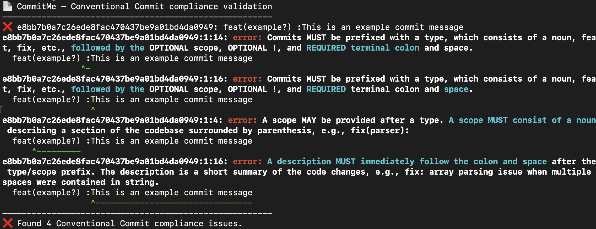

<!-- 
SPDX-FileCopyrightText: 2023 Kevin de Jong <monkaii@hotmail.com>

SPDX-License-Identifier: GPL-3.0-or-later
-->

# CommitMe

CommitMe provides multiple tools for validating commit messages against [Conventional Commits], incl.

* A CLI tool for managing your local (git) repository
* A GitHub Action to validate your Pull Request contents

Both use the same [output format](#output-format) for expressing non-compliance issues.

## Tools

### Command Line Interface

The CLI tool can be used for local operations around your git repository, validating the commits in your current branch against the main branch (`main`).

> **NOTE** Option to specifiy the baseline branch will be added later

#### Example usage

Running the `check` command...
```
$ commit-me check
```

...will result in output similar to:



> **NOTE**: highlighting and colors are applied in case your shell support this.

_You can find more details in the [dedicated documentation](./docs/cli.md)_

### GitHub Action

The GitHub Action provides:

* Validation of all commits as part of your current Pull Request.
* Ability to update labels on your Pull Request (`feature`, `fix`, `breaking`)

### Example usage

```yaml
name: Conventional Commits
on:
  pull_request:

permissions:
  pull-request: write

jobs:
  commit-me:
    name: Conventional Commit compliance
    runs-on: ubuntu-latest
    steps:
      - uses: dev-build-deploy/commit-me@v0
        with:
          token: ${{ github.token }}
          update-labels: true  # OPTIONAL; manages labels on your Pull Request, defaults to `true`
```

This will result in output similar to:


In addition;
* Annotations are added containing a non-compliance issue.
* A [label](./docs/github-action.md#labels) (`breaking`, `feature` or `fix`) is added to your Pull Request.

_You can find more details in the [dedicated documentation](./docs/github-action.md)_

## Output format

CommitMe is using an output format derived from LLVMs [expressive diagnostics formatting](https://clang.llvm.org/docs/ClangFormatStyleOptions.html#expressive-diagnostic-formatting);

```
2d9f21c2e2bb0f61ff88a99e5c0cb8d5771313c7:1:0: error: Commits MUST be prefixed with[...]
^                                        ^ ^         ^
|                                        | |         |
|                                        | |         `-- Conventional Commits requirement
|                                        | `-- Column bumber
|                                        `-- Line number
`-- Commit SHA                                   
```

> **NOTE**: The Conventional Commits requirement is truncated in the above example

| Item | Description |
| --- | --- |
| `Commit SHA` | The commit hash of the commit containing non compliance issue |
| `Line number` | Which line in the commit message contains the issue (**NOTE**: line 1 indicates the subject) |
| `Column number` | Starting index of the non compliance issue |
| `Conventional Commits requirement` | Full description taken from the [Conventional Commits specification](https://www.conventionalcommits.org/en/v1.0.0/#specification), with highlights indicating which parts are non-compliant |

## Contributing

If you have suggestions for how commit-me could be improved, or want to report a bug, open an issue! We'd love all and any contributions.

For more, check out the [Contributing Guide](CONTRIBUTING.md).

## License

[GPL-3.0-or-later AND CC0-1.0](LICENSE) © 2023 Kevin de Jong \<monkaii@hotmail.com\>

[Conventional Commits]: https://www.conventionalcommits.org/en/v1.0.0/
